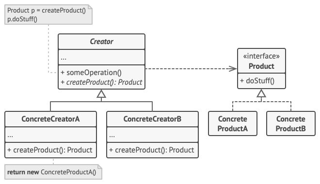

# Situación

Imagina que estás creando una aplicación de gestión logística. La primera
versión de tu aplicación sólo es capaz de manejar el transporte en camión, por
lo que la mayor parte de tu código se encuentra dentro de la clase Camión.

Al cabo de un tiempo, tu aplicación se vuelve bastante popular. Cada día recibes
decenas de peticiones de empresas de transporte marítimo para que incorpores la
logística por mar a la aplicación.


Estupendo, ¿verdad? Pero, ¿qué pasa con el código? En este momento, la mayor
parte de tu código está acoplado a la clase Camión. Para añadir barcos a la
aplicación habría que hacer cambios en toda la base del código. Además, si más
tarde decides añadir otro tipo de transporte a la aplicación, probablemente
tendrás que volver a hacer todos estos cambios.

Al final acabarás con un código bastante sucio, plagado de condicionales que
cambian el comportamiento de la aplicación dependiendo de la clase de los
objetos de transporte.

# Solución

El patrón Factory Method sugiere que, en lugar de llamar al operador `new` para
construir objetos directamente, se invoque a un método fábrica especial. No te
preocupes: los objetos se siguen creando a través del operador `new`, pero se
invocan desde el método fábrica. Los objetos devueltos por el método fábrica a
menudo se denominan productos.


A simple vista, puede parecer que este cambio no tiene sentido, ya que tan solo
hemos cambiado el lugar desde donde invocamos al constructor. Sin embargo,
piensa en esto: ahora puedes sobrescribir el método fábrica en una subclase y
cambiar la clase de los productos creados por el método.

No obstante, hay una pequeña limitación: las subclases sólo pueden devolver
productos de distintos tipos si dichos productos tienen una clase base o
interfaz común. Además, el método fábrica en la clase base debe tener su tipo de
retorno declarado como dicha interfaz.


Por ejemplo, tanto la clase `Camión` como la clase `Barco` deben implementar la
interfaz `Transporte`, que declara un método llamado `entrega`. Cada clase
implementa este método de forma diferente: los camiones entregan su carga por
tierra, mientras que los barcos lo hacen por mar. El método fábrica dentro de la
clase `LogísticaTerrestre` devuelve objetos de tipo camión, mientras que el
método fábrica de la clase `LogísticaMarítima` devuelve barcos.


El código que utiliza el método fábrica (a menudo denominado código cliente) no
encuentra diferencias entre los productos devueltos por varias subclases, y
trata a todos los productos como la clase abstracta Transporte. El cliente sabe
que todos los objetos de transporte deben tener el método entrega, pero no
necesita saber cómo funciona exactamente.



**Tomado de:** https://refactoring.guru/es/design-patterns/factory-method

## Uso:

Para probar el ejemplo usando TypeScript

Abre tu terminal y desde la ruta `./FactoryMethod` ejecuta el siguiente comando:

```bash
    npm install -g typescript
```

Luego ejecuta el siguiente comando:

```bash
    tsc logistica.ts
```
Esto generará un archivo `logistica.js` 

Finalmente ejecuta el siguiente comando:

```bash
    node logistica.js
```

Esto ejecutará el código y mostrará la salida en la consola.